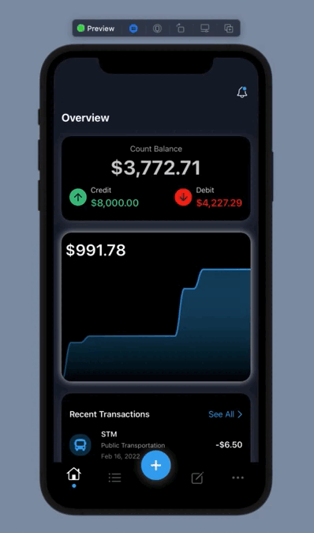
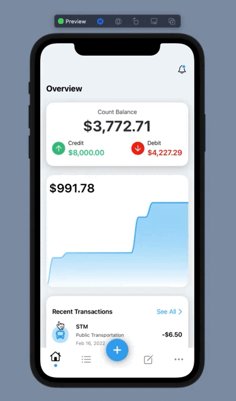

<h1> FinancialApp </h1>

> Status: Developer ☝️

## Goal
This project is an app to manage your finances. You will be able to view your debits and credits with the dynamic chart.

☝️ This project is in development, read external api.

 
  
  

## Tools
* Swift 5

## Libary
* SwiftUiCharts;
* Swift-collections;
* SwiftUiFontIcon.

## API
* Design code: https://designcode.io/data/transactions.json

 
  <small> Josileudo Rodrigues - 2022</small>
</div
